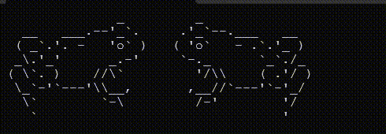

# Enunciado

Hacer un programa que permita mostrar animaciones de ascii_art.
Cada frame o cuadro de la animación se encuentra en un archivo de texto separado por el código "[frame!]".
Por ejemplo:
```
[frame!]
              _         _
  __   ___.--'_`.     .'_`--.___   __
 ( _`.'. -   'o` )   ( 'o`   - .`.'_ )
 _\.'_'      _.-'     `-._      `_`./_
( \`. )    //\`         '/\\    ( .'/ )
 \_`-'`---'\\__,       ,__//`---'`-'_/
  \`        `-\         /-'        '/
   `                               '   
[frame!]
              _        _
  __   ___.--'_`.    .'_`--.___   __
 ( _`.'. -   'o` )  ( 'o`   - .`.'_ )
 _\.'_'      _.-'    `-._      `_`./_
( \`. )    //\`        '/\\    ( .'/ )
 \_`-'`---'\\__,      ,__//`---'`-'_/
  \`        `-\        /-'        '/
   `                              '              
[frame!]
              _  ♡♡  _
  __   ___.--'_`.  .'_`--.___   __
 ( _`.'. -   'o` == 'o`   - .`.'_ )
 _\.'_'      _.-'  `-._      `_`./_
( \`. )    //\`      '/\\    ( .'/ )
 \_`-'`---'\\__,    ,__//`---'`-'_/
  \`        `-\      /-'        '/
   `                            '   
[frame!]
              _       _
  __   ___.--'_`.   .'_`--.___   __
 ( _`.'. -   'o` ) ( 'o`   - .`.'_ )
 _\.'_'      _.-'   `-._      `_`./_
( \`. )    //\`       '/\\    ( .'/ )
 \_`-'`---'\\__,     ,__//`---'`-'_/
  \`        `-\       /-'        '/
   `                             '    
```

El resultado final debería ser:



## Configuración
La primera línea del archivo debe contener la configuración de la animación con los siguientes parámetros:
VELOCIDAD: Es un valor numérico que puede ser decimal, indicando el tiempo en segundos que se muestra cada cuadro
REPETIR: Indica si al finalizar la animación se debe repetir desde el comienzo. Los valores posibles son SI y NO. 

Un ejemplo de una línea de configuración sería:
VELOCIDAD=0.5;REPETIR=SI

## Ejecución
El programa debe recibir como parámetro el nombre del archivo de texto que contiene los frames o cuadros de la animación.